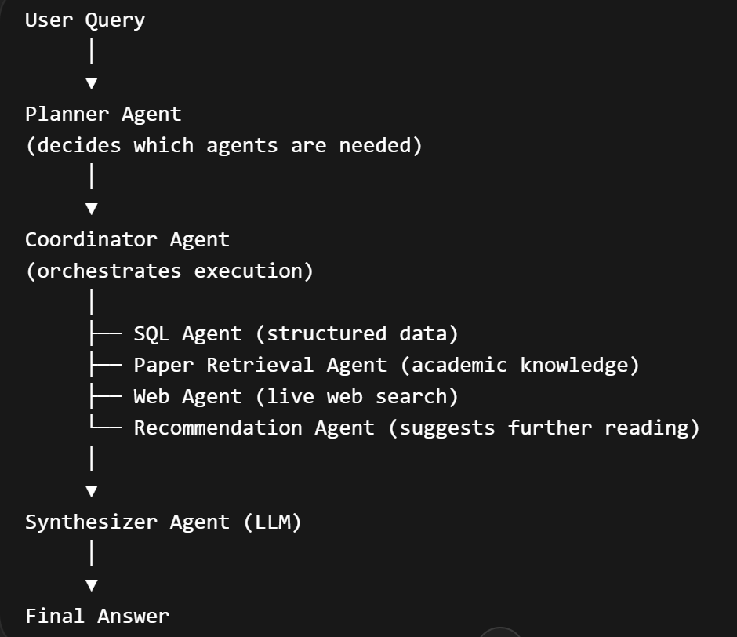
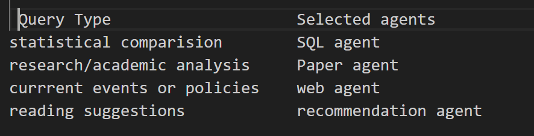
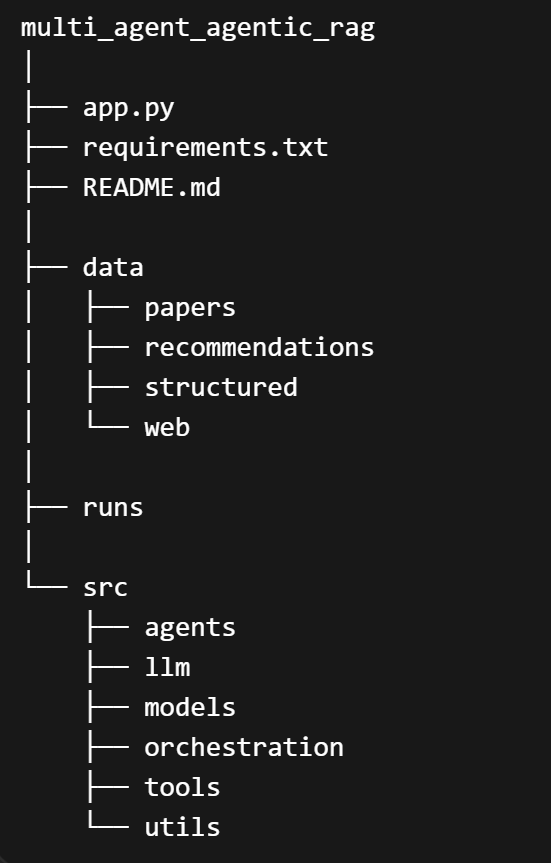

# **Multi-Agent agentic RAG system**

## **Overview:**
This projects implements a Muilti-Agent agentic Retrieval Augmented Generation(RAG) System, that answers complex questions by coordinating multiple specialized agents. Instead of reklying on single retrieval pipeline, the system distributes tasks across multiple agents for different data sources and retrieval strategies.

The system inspired by Multi-agent agentic RAG architecture, where coordinator agent orchestrates specialized retrieval agents, integrates their outputs and generates a response using LLM.

This approach improves modularity, scalability and retrieval quality and allows the system to combine strcutural data, academic knowledge and live web information.

## **System architecture:**

  

# **Agents in the system:**

## **Coordinator agent:**
This acts as a central orchestrator of the system . It receives the user query and calls the planner agents to determine which agents are needed, executes the selected agents and passes their outputs to the synthesizer agent.

Responsibilities: Route queries, execute agents, collect results, track latency and cost and produce final response.

## **Planner Agent:**
 It analyzes the user query and determines which agent should run.

## **Sql agent:**
It retrieves the structured data from database.

Data sources include: renewable energy share, emission data, investment statistics, employment indicators

these are stored in a SQLite database built from csv datasets.

Example questions handled by it:
1. compare renewable share across countries
2. emissions statistics
3. energy investment comparisions

## paper retrieval agent:

It performs semantic retrieval across academic documents and reports.
Sources included: energy transition research papers, policy analysis reports, expert commentary.

Documents are embedded into vector database to enable semantic search.

example questions handled:
academic insights on energy transitions, policy design impacts, research summaries

## web agent:
It retrives live info from internet.

It perfroms web search queries and prioritizes trusted energy and policy sources such as: internet energy agency, europen commision, IRENA, EU energy portals

This allows the system to retrieve recent policy updates and market developments.

## Recommendation agent:
It suggests relevant follow-up readings such as:
research papers, policy reports, expert commentary

This helps users to explore topics in greater depth

## Synthesizer Agent:
It uses LLM to integrate info retrieved by all agents
It produces final responses that:
combines insights from multiple sources
separate evidence from interpretation
avoids unsupported causal claims
clearly structures the answer

## Key features:

Multi agent architecture: Each agent specializes in a different task or data source, improving retrieval quality.

Parallel Retrieval: Agents can run independently, enabling efficient information gathering.

Modular Design: Agents can be easily added or removed without affecting the overall system.

Hybrid Data Sources:

The system combines:structured databases, academic documents, live web information, curated recommendations

Cost and Latency Tracking:

Each agent tracks: execution latency, API cost (if applicable)

The system includes cost tracking for LLM and external API usage. In this implementation the total cost is $0.0000 because the system uses a locally hosted LLM via Ollama and local data sources (SQLite database and vector store), avoiding any paid API services.

This improves transparency and reproducibility

Project Structure: 

## How to run: 
1. install dependencies
2. python app.py
3. ask a question

Enter your query:
What are the economic and environmental impacts of renewable energy adoption in Europe?
The system will:
1. select relevant agents
2. retrieve information
3. synthesize a final response

## Example queries:
1. Research Queries: compare renewable share and emissions across European countries
2. Research Queries: what are the economic impacts of renewable energy adoption in Europe
3. Recommendation Queries: latest renewable energy policy updates in Europe
4. Recommendation Queries: recommend follow-up reading on renewable investment policy

## Example Output

The system returns:
1. selected agents
2. sources retrieved
3. final synthesized answer
4. latency statistics
5. execution trace

## Technologies Used:
Python, Chroma Vector Database, Sentence Transformers, SQLite, Ollama LLM

## Learning Goals:
This project demonstrates key ideas in modern agent-based AI systems:
1. multi-agent orchestration
2. retrieval-augmented generation
3. modular agent design
4. hybrid data retrieval
5. LLM-based synthesis

## Future Improvements:

Potential enhancements include:
1. more advanced inter-agent communication
2. improved ranking of retrieved sources
3. additional domain-specific agents

## Screenshots
Example system runs are included in the repository.
